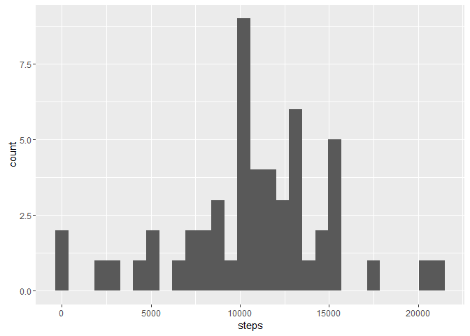

Loading and preprocessing the data
----------------------------------

    data <- read.csv("activity.csv")
    data$date <- as.Date(data$date)

What is mean total number of steps taken per day?
-------------------------------------------------

Firstly, calculate the total number of steps taken per day

    totalSteps <- aggregate(steps ~ date, data, sum, na.rm = TRUE)

Secondly, make a histogram of the total number of steps taken each day

    library(ggplot2)
    qplot(steps, data = totalSteps, bins = 30)

Thirdly, calculate and report the mean and median of the total number of
steps taken per day

    mean(totalSteps$steps)

    ## [1] 10766.19

    median(totalSteps$steps)

    ## [1] 10765

What is the average daily activity pattern?
-------------------------------------------

Firstly, make a time series plot of the 5-minute interval (x-axis) and
the average number of steps taken, averaged across all days (y-axis)

    library(ggplot2)
    stepsInterval <- aggregate(steps ~ interval, data, mean, na.rm = TRUE)
    ggplot(stepsInterval, aes(interval, steps)) + geom_line()

Secondly, which 5-minute interval, on average across all the days in the
dataset, contains the maximum number of steps?

    stepsInterval$interval[which.max(stepsInterval$steps)]

    ## [1] 835

Imputing missing values
-----------------------

Firstly, calculate and report the total number of missing values in the
dataset (i.e. the total number of rows with NAs)

    sum(is.na(data$steps))

    ## [1] 2304

Secondly, devise a strategy for filling in all of the missing values in
the dataset. The strategy does not need to be sophisticated. For
example, you could use the mean/median for that day, or the mean for
that 5-minute interval, etc.

-   I use the mean for that 5-minute interval to fill in missing values

Thirdly, create a new dataset that is equal to the original dataset but
with the missing data filled in.

    newData <- data
    for(i in 1:nrow(newData)) {
        if(is.na(newData[i,]$steps)) {
            newData[i,]$steps = stepsInterval[stepsInterval$interval == 
                newData[i,]$interval,]$steps
        }
    }

Finally, make a histogram of the total number of steps taken each day
and Calculate and report the mean and median total number of steps taken
per day. Do these values differ from the estimates from the first part
of the assignment? What is the impact of imputing missing data on the
estimates of the total daily number of steps?

-   Histogram

<!-- -->

    library(ggplot2)
    newTotalSteps <- aggregate(steps ~ date, newData, sum, na.rm = TRUE)
    qplot(steps, data = newTotalSteps, bins = 30)

-   Mean and Median

<!-- -->

    mean(newTotalSteps$steps)

    ## [1] 10766.19

    median(newTotalSteps$steps)

    ## [1] 10766.19

-   Impact of imputing: The difference comes from 8 days, which have no
    available data for steps (so steps in these dates are all NA's).
    Before filling with the mean, these dates are not shown in the
    histogram, but after it, they all become mean values. So we can see
    a boom in an interval slightly over 10000. They are all filled
    mean values. In addition, the median become equal to the mean
    because of the same reason.

Are there differences in activity patterns between weekdays and weekends?
-------------------------------------------------------------------------

Firstly, create a new factor variable in the dataset with two levels -
“weekday” and “weekend” indicating whether a given date is a weekday or
weekend day.

    newData$day <- factor(
        ifelse(weekdays.Date(newData$date) %in% c("Saturday", "Sunday"),
               "weekend", "weekday")
        )

Secondly, make a panel plot containing a time series plot of the
5-minute interval (x-axis) and the average number of steps taken,
averaged across all weekday days or weekend days (y-axis).

    library(ggplot2)
    stepsInterval2 <- aggregate(steps ~ interval + day, data = newData, mean,
                                na.rm = TRUE)
    ggplot(stepsInterval2, aes(interval, steps)) + geom_line() + facet_grid(day ~ .)

